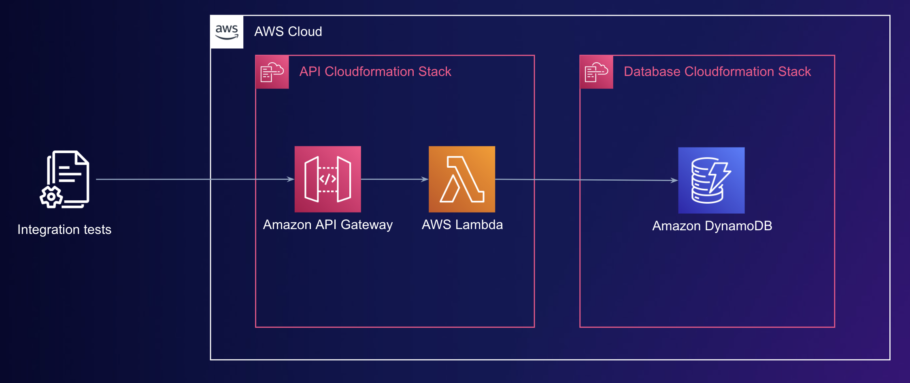

# aws-summit-stockholm-demo

This is the source code for the demo presented at AWS Summit Stockholm, MA-03: Supercharge your DevOps practice with a cloud-native, cloud-first approach.

The code is a simple example, but the patterns shown here are the ones we use on a day-to-day basis at Plain.

For a related blog post, have a read of [our Magical AWS Serverless Developer Experience](https://journal.plain.com/posts/2022-02-08-a-magical-aws-serverless-developer-experience/).

## Architecture

This is a simple API that is responsible for managing workspaces and customers.
The data is stored in DynamoDB.



The API has 4 operations implemented:
1. Create workspace
2. Get workspace
3. Create customer
4. Get customer

## Code walkthrough

### Integration test

The integration test runs against a deployed instance of the application without any mocks.
This is referred to as "cloud-first" testing.

What this means is that we need to get an API Gateway URL to send our requests to.
Due to Cloudformation having very low rate limits, we have a tiny script, [cacheCloudformationOutputs.ts](./test-utils/cacheCloudformationOutputs.ts), that caches these outputs to file.
When running tests in parallel this acts as a shared read cache.

The test code can then use [getCloudformationOutputs.ts](./test-utils/getCloudformationOutputs.ts) to get the API Gateway URL to send requests to.
If you're testing other things like SQS, SNS, EventBridge, DynamoDB, etc. then you can apply a similar pattern of getting their ARNs or names.

The integration test we have written is the [postCustomer.itest.ts](./services/customer/postCustomer.itest.ts), which has a few test cases.

We do the following three things to make writing tests easy:
1. Have our domain layer "pure" of an API specific detail (for example that it runs in a Lambda). This allows us to invoke the domain layer in our tests and easily set up the required state before a test.
2. Pass in all our dependencies to domain functions via `ctx`. This makes it easy for tests to create a small test context with only the smallest amount of required dependencies.
3. Tests don't share state, we create a new workspace (tenant) in each test suite therefore allowing us to massively parallelize these tests. 

### Lambda handler

The handler is responsible for doing some basic input validation for which we use [zod](https://github.com/colinhacks/zod).

We also use [aws-lambda-powertools-typescript](https://github.com/awslabs/aws-lambda-powertools-typescript) for our logging framework.

### Domain code

Our domain code uses on explicit error return types via [true-myth](https://github.com/true-myth/true-myth), this makes it clear on the domain API that it can error and what those error cases are.

## Setup

Required: Node.js 14

To install dependencies:

```bash
$ npm install
```

AWS credentials need to be configured in your local environment.

Then to run the application in Live Lambda Development mode run:

```bash
$ npm run start
```

## Commands

### `npm run start`

Starts the local Lambda development environment.

### `npm run test:integration`

Runs the integration tests that test against live AWS services.

### `npm run build`

Build your app and synthesize your stacks.

Generates a `.build/` directory with the compiled files and a `.build/cdk.out/` directory with the synthesized CloudFormation stacks.

### `npm run deploy [stack]`

Deploy all your stacks to AWS. Or optionally deploy a specific stack.

### `npm run remove [stack]`

Remove all your stacks and all of their resources from AWS. Or optionally remove a specific stack.

## About Plain

We’re building the fastest way to provide amazing customer service. A tool that comes with modern defaults, an opinionated workflow and a lightning-fast UI — all backed by our powerful API.

Our vision is to build the go-to customer service infrastructure for the companies of the next decade.

Interested in using Plain or joining us on our mission? Check out [www.plain.com](https://www.plain.com)!

## More Serverless Stack Documentation

Learn more about the Serverless Stack.

- [Docs](https://docs.serverless-stack.com)
- [@serverless-stack/cli](https://docs.serverless-stack.com/packages/cli)
- [@serverless-stack/resources](https://docs.serverless-stack.com/packages/resources)
